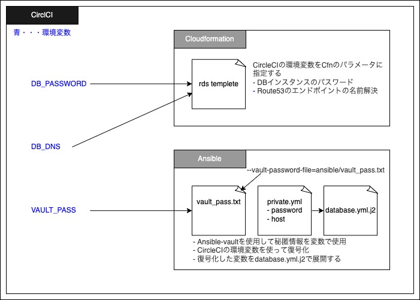

# CircleCI
Githubと連携することで以下の作業を自動化
- CloudFormationによるスタックの作成及びアップデート
- AnsibleによるEC2の環境構築及びアプリケーションのデプロイ
- Serverspecによる環境及びアプリケーションの状態を確認するテストコード実行
<br>
<br>

## Directory
***
```
.circleci
│── config.yml #タスクを記述
└── Readme.md
```
<br>
<br>

## Orbs
***
シェルスクリプトで各タスクを実行することができるが、Orbsを使用することで効率よく記述できる。  
以下のOrbsを使用。  
- [circleci/aws-cli@3.0.0](https://circleci.com/developer/ja/orbs/orb/circleci/aws-cli)
- [orbss/aws-cloudformation@0.1.6](orbss/aws-cloudformation@0.1.6)
- [orbss/ansible-playbook@0.0.5](orbss/ansible-playbook@0.0.5)  


<br>
<br>

## 環境変数
***
Cloudformation、Ansibleに使用する秘匿情報のハードコーディングを防ぐ為に使用。
CircleCIのProject SettingsのEnvironment Variablesに以下の変数を登録。   

- ANSIBLE_INVENTORY
- ANSIBLE_SSH_KEY
- AWS_ACCESS_KEY_ID
- AWS_DEFAULT_REGION
- AWS_SECRET_ACCESS_KEY
- DB_PASSWORD
- DB_DNS
- VAULT_PASSWORD
<br>
<br>

## SSH keys
***
秘匿情報のハードコーディングを防ぐ為に使用。  
CircleCIのProject SettingsのSSH keysに以下のホストに紐づく秘密鍵を登録。   
- 35.78.146.159
- 13.112.38.53
<br>
<br>

## DBの秘匿情報のハンドリング
***
database.ymlのpasswordとhost情報を下図のようにして機密性を確保しています。
  
<br>
<br>

## コマンドやtips
***
- 構文チェックコマンド・・・`circleci config validate`
- CI/CDをパスする・・・コミットメッセージに`[ci skip]`を含める
