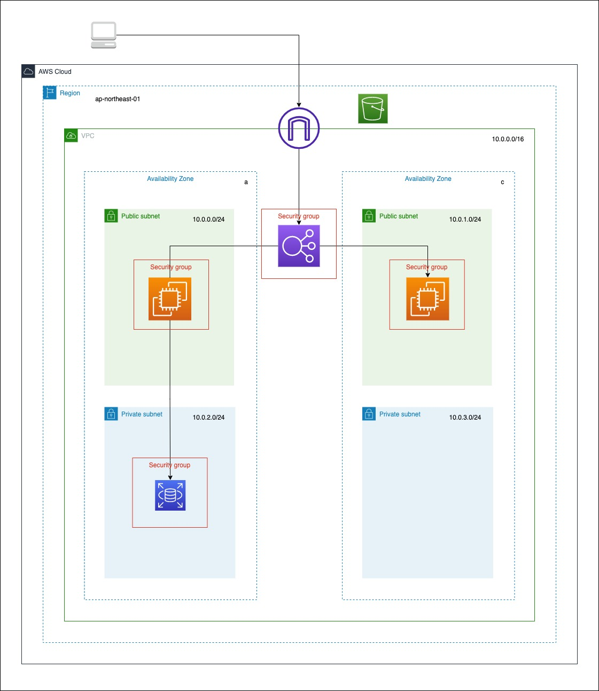

# Cloudformation
OSレイヤーの各種設定状態をサーバー内部から確認する。RSpecというrubyのテストフレームワークを使用している。
<br>
<br>

## 構成図
***

<br>
<br>

## Direcroty
***
```
└── service
    ├── ec2.yml
    ├── infrastructure.yml
    ├── rds.yml
    ├── s3.yml
    └── vpc.yml
```
<br>
<br>
